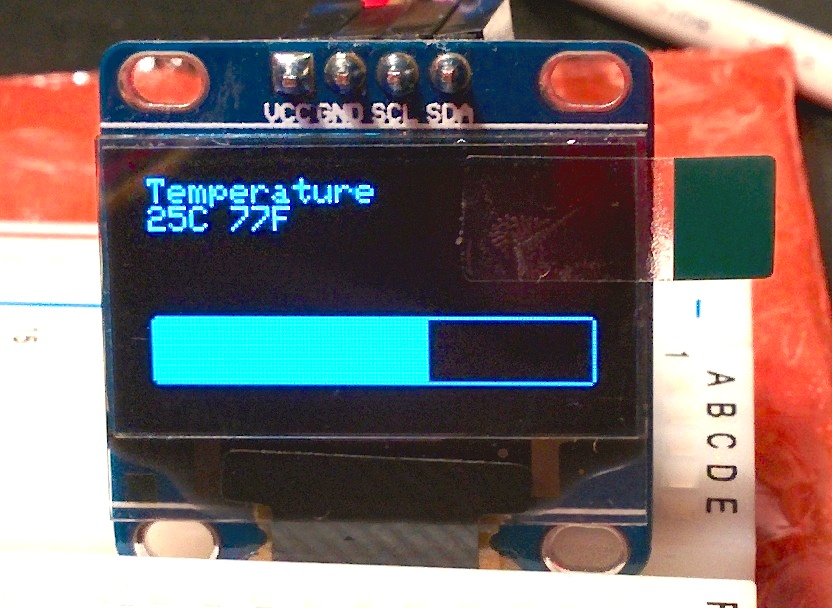
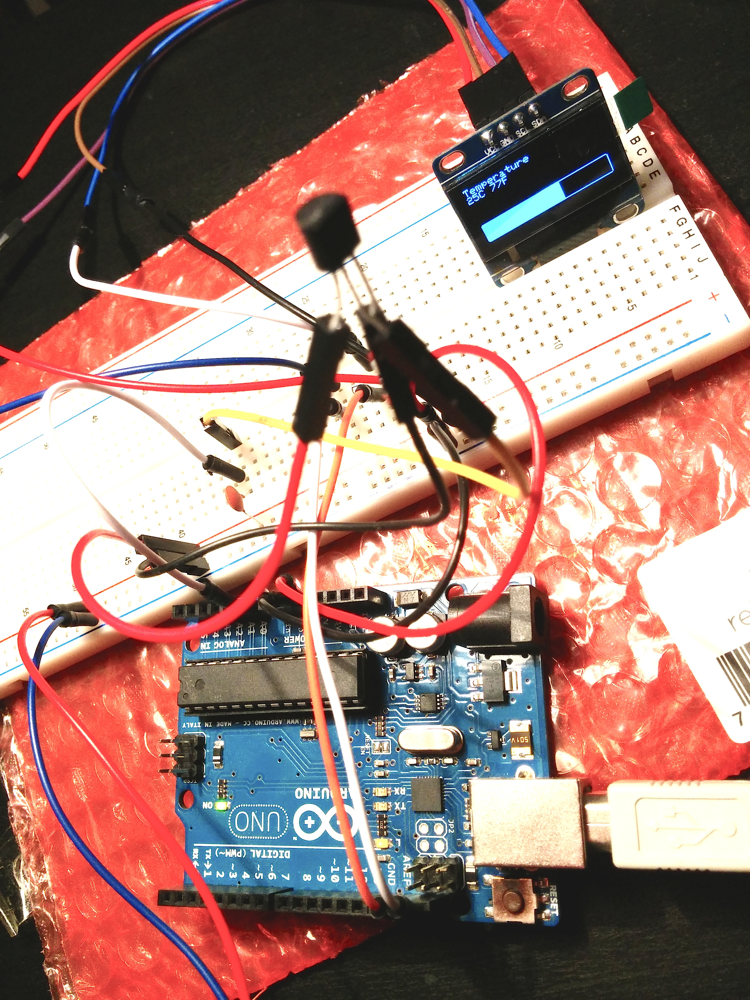

arduino-thermometer
===================
Displays temperature measured using TMP36 sensor on OLED Adafruit compatible display managed over I2C bus
  
Requires:
* TMP36 sensor
* OLED Adafruit compatible display
* https://github.com/adafruit/Adafruit_SSD1306
* https://github.com/adafruit/Adafruit-GFX-Library

